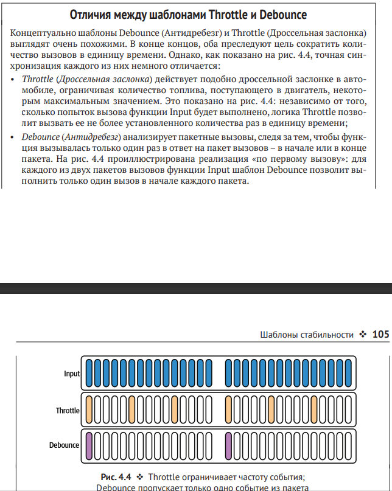

## Throttle (Дроссельная заслонка)
Шаблон Throttle (Дроссельная заслонка) ограничивает частоту вызовов функции некоторым предельным числом вызовов в единицу времени.
Применимость
Шаблон Throttle (Дроссельная заслонка) назван в честь устройства, регулирующего поток жидкости, например топлива, поступающего в двигатель автомобиля. Как и его одноименный механизм, шаблон Throttle (Дроссельная
заслонка) ограничивает количество вызовов функции в течение определенного периода времени. Например:
 пользователю может быть разрешено обращаться к  службе не чаще,
чем 10 раз в секунду;
 клиенту может быть позволено вызывать определенную функцию
только один раз в каждые 500 миллисекунд;
 учетной записи может быть разрешено только три неудачные попытки
входа в систему в течение 24 часов.
Наиболее распространенной причиной применения шаблона Throttle
(Дроссельная заслонка) является устранение резких всплесков активности,
способных привести к насыщению системы необоснованным количеством
дорогостоящих запросов, которые могут привести к  ухудшению качества
обслуживания и  в  конечном итоге к  отказу. Система может поддерживать
автоматическое масштабирование для удовлетворения потребностей пользователей, но на это требуется время, и система может быть не в состоянии
реагировать достаточно быстро.
Отличия между шаблонами Throttle и Debounce
Концептуально шаблоны Debounce (Антидребезг) и Throttle (Дроссельная заслонка)
выглядят очень похожими. В конце концов, оба преследуют цель сократить количество вызовов в единицу времени. Однако, как показано на рис. , точная синхронизация каждого из них немного отличается:
• Throttle (Дроссельная заслонка) действует подобно дроссельной заслонке в автомобиле, ограничивая количество топлива, поступающего в  двигатель, некоторым максимальным значением. Это показано на рис: независимо от того,
сколько попыток вызова функции Input будет выполнено, логика Throttle позволит вызвать ее не более установленного количества раз в единицу времени;
• Debounce (Антидребезг) анализирует пакетные вызовы, следя за тем, чтобы функция вызывалась только один раз в ответ на пакет вызовов – в начале или в конце
пакета. На рис.  проиллюстрирована реализация «по первому вызову»: для
каждого из двух пакетов вызовов функции Input шаблон Debounce позволит выполнить только один вызов в начале каждого пакета.
